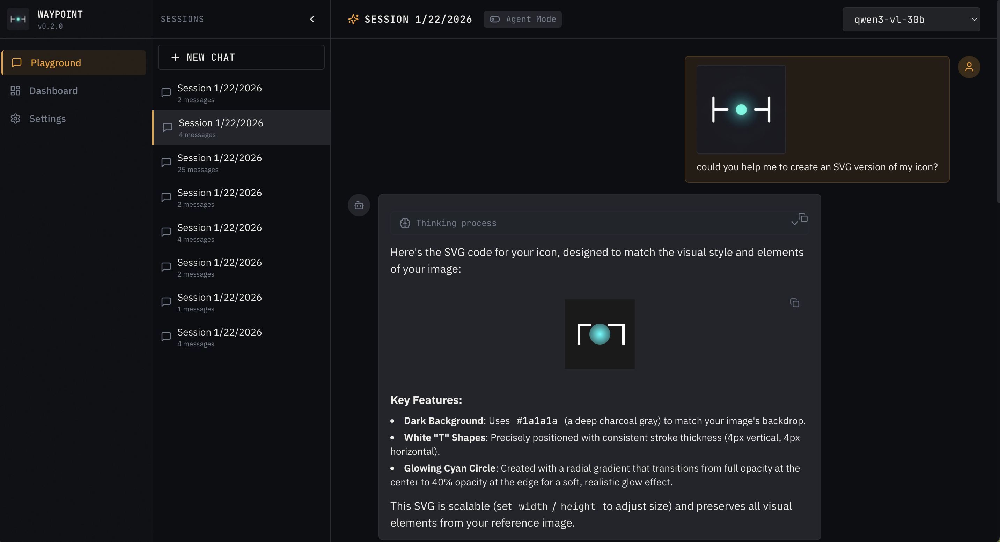
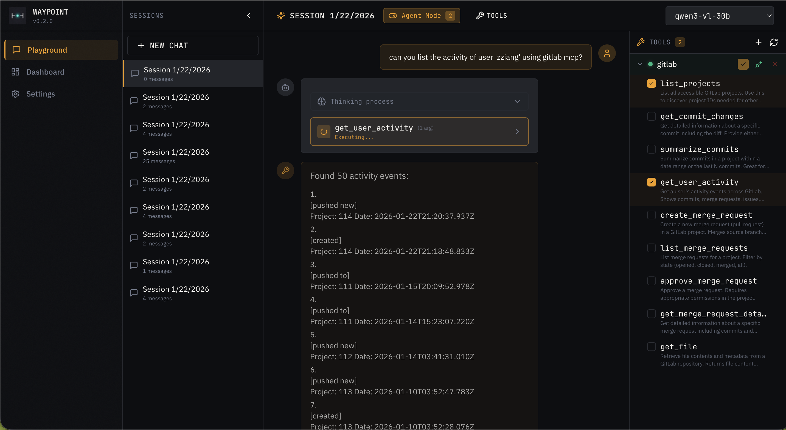
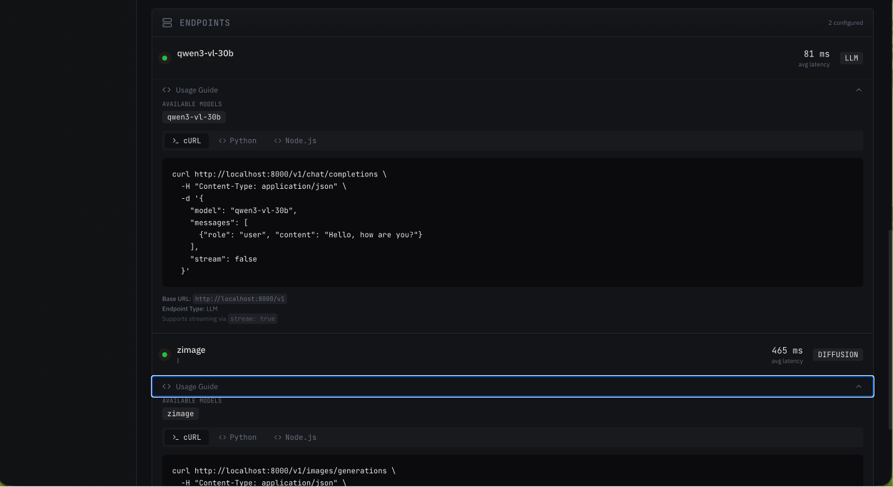
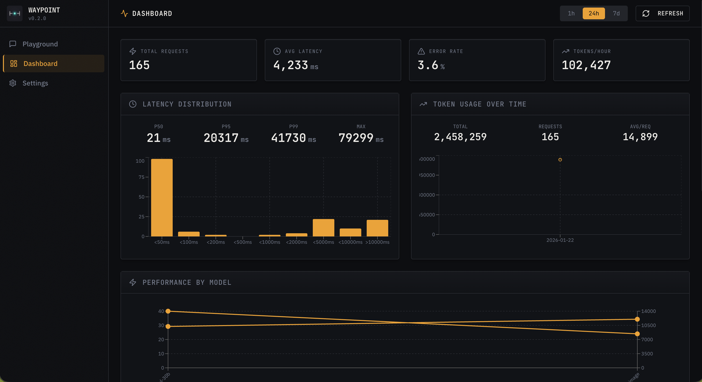

<p align="center">
  
</p>

<h1 align="center">Waypoint</h1>

<p align="center">
  <strong>Local AI Gateway</strong> — OpenAI-compatible proxy with intelligent routing, failover, and a built-in playground UI for agentic workflows.
</p>

<p align="center">
  <em>Sometimes a good LLM endpoint works behind a bad SSL cert. Waypoint bridges the gap—connect to any backend, handle SSL issues gracefully, and unify multiple endpoints behind one secure local interface.</em>
</p>

---

## Screenshots

### Playground
<p align="center">
  
</p>

### Agent Mode with Tool Calling
<p align="center">
  
</p>

### Endpoint Proxy & Usage Guides
<p align="center">
  
</p>

### Dashboard
<p align="center">
  
</p>

### Naming and Logo

I admit, the name "Waypoint" is proposed by LLM (shut out to Qwen3-vl-30B) after it reads my early repositoy. In the beginning, the work was just intended to be a simple proxy for ill-configured LLM endpoints. I am talking about PCAI.

At the time, way point was just a term, similar to "route point", providing access to the LLM endpoints.

As I learn more about the AI agents, I start to be convinced the name do has more meanings. AI agents are clearly a waypoint to the future AGI, superintelligence or singularity. I hope this project can be my stepping stone to that future.

But I feel I am not smart enough to do it by myself. In this sense, the project can provide a helping waypoint betwen me and a smarter me, what I projected myself in my tiny mind.

I asked the LLM (thanks again qwen3-vl-30B) to design a logo prompt and `zimage` to generate the logo. After several rounds of judging, the winner comes with the following prompt:

> Minimal abstract gateway icon, two vertical parallel lines with a glowing orb passing through center, neon cyan accent on dark background, geometric precision, symbolizing data flow through a unified portal, clean vector style, icon design

Suprisingly, the logo looks like a layed down box plot. 

Here is the ascii art version of the logo:

```
├─o─┤
```

---

## Features

- **Reverse Proxy** — Route LLM, diffusion, audio, and embedding requests to multiple backends
- **Health-Based Failover** — Automatic retry with circuit breaker and latency-aware routing
- **Web UI** — Playground with chat history, image support, and real-time dashboard
- **Agent Mode** — MCP (Model Context Protocol) integration for tool-calling workflows
- **Model Capability Matrix** — Per-model input/output modality classification (`text`, `image`, `audio`, `embedding`)
- **Lightweight Benchmark** — Built-in and file-driven benchmark scenarios (`waypoint bench`)
- **Statistics** — Request tracking with 7-day window and per-model/endpoint aggregation
- **Hot Reload** — Config changes apply without restart
- **Auth Ready** — Optional authentication (disabled by default)

## Architecture

```
┌─────────────────────────────────────────────────────────────────────┐
│                           Waypoint Gateway                          │
├─────────────────────────────────────────────────────────────────────┤
│  Routes:                                                            │
│    /v1/chat/completions    → LLM backends                          │
│    /v1/embeddings          → Embedding backends                     │
│    /v1/images/*            → Diffusion backends                     │
│    /v1/audio/*             → Audio backends (TTS/STT)               │
│    /v1/models              → Aggregated model list                  │
│    /v1/responses           → Responses API shim                     │
│    /mcp                    → Built-in MCP tool server               │
│                                                                     │
│  Admin:                                                             │
│    /admin/endpoints        → Endpoint CRUD                          │
│    /admin/health           → Health status                          │
│    /admin/stats            → Request statistics                     │
│    /admin/sessions         → Chat session storage                   │
│    /admin/mcp/*            → MCP server management                  │
│                                                                     │
│  UI:                                                                │
│    /ui                     → React playground & dashboard           │
├─────────────────────────────────────────────────────────────────────┤
│  Storage (~/.config/waypoint):                                      │
│    config.yaml       │ Endpoint configuration                       │
│    health.json       │ Health state cache                           │
│    stats/*.jsonl     │ Request logs (30-day rotation)               │
│    sessions/*.json   │ Chat session history                         │
│    images/           │ AIGC image cache (LRU, 1GB default)          │
│    mcp-servers.yaml  │ MCP server registry                          │
└─────────────────────────────────────────────────────────────────────┘
```

## Quickstart

```bash
# Install dependencies
npm install
cd ui && npm install && cd ..

# Build
npm run build:all

# Start server
npm run start
```

Open http://localhost:8000/ui for the web interface.

## Add an Endpoint

```bash
# Via CLI
waypoint add \
  --name local-llm \
  --url http://localhost:11434 \
  --priority 1 \
  --type llm \
  --model local-default=llama3

# Diffusion endpoint
waypoint add \
  --name local-sd \
  --url http://localhost:7860 \
  --priority 1 \
  --type diffusion \
  --model sd-xl=stable-diffusion-xl
```

## OpenAI-Compatible Endpoints

| Endpoint | Description |
|----------|-------------|
| `POST /v1/chat/completions` | Chat with streaming and tool calling |
| `POST /v1/embeddings` | Text embeddings for RAG |
| `GET /v1/models` | List available models |
| `POST /v1/images/generations` | Image generation |
| `POST /v1/images/edits` | Image editing |
| `POST /v1/audio/transcriptions` | Speech-to-text |
| `POST /v1/audio/speech` | Text-to-speech |
| `POST /v1/responses` | Responses API shim |
| `POST /mcp` | Built-in MCP service endpoint |

`GET /v1/models` includes both legacy `endpoint_type` and detailed `capabilities` metadata when available.

### Responses API Shim

Waypoint exposes `/v1/responses` as a compatibility shim for clients that use Responses-style requests.
Internally, requests are translated to chat completions and routed through the same failover path.

Key behavior:

- `input_text` / `output_text` content parts are normalized to `text`
- function call payloads are mapped to OpenAI tool-call shape
- `developer` role is normalized to `system`

For `stream: true`, Waypoint emits Responses-style SSE events (`response.created`, deltas, output items, and `response.completed`).

## Admin Endpoints

| Endpoint | Description |
|----------|-------------|
| `GET /admin/endpoints` | List all endpoints |
| `POST /admin/endpoints` | Add endpoint |
| `PATCH /admin/endpoints/:id` | Update endpoint |
| `DELETE /admin/endpoints/:id` | Remove endpoint |
| `GET /admin/health` | Health status by endpoint |
| `GET /admin/stats` | Aggregated statistics |
| `GET /admin/stats/latency` | Latency distribution |
| `GET /admin/stats/tokens` | Token usage over time |
| `GET/POST/DELETE /admin/sessions` | Chat session CRUD |
| `GET/POST/DELETE /admin/mcp/servers` | MCP server CRUD |
| `GET /admin/mcp/tools` | List discovered tools |
| `POST /admin/mcp/tools/execute` | Execute a tool |
| `GET /admin/providers` | Provider catalog |
| `GET /admin/providers/:id` | Provider details |
| `GET /admin/pools` | Smart pool definitions |
| `POST /admin/pools/rebuild` | Rebuild smart pools from providers |

## Built-In MCP Service (`/mcp`)

Waypoint exposes a first-party MCP server for local agent-to-tool workflows without going through chat models.

- Endpoint: `POST /mcp` (Streamable HTTP MCP transport)
- Access: localhost only (`localhost`, `127.0.0.1`, `::1`)
- Auth: intentionally open on localhost, even when `authEnabled=true`

Client flow:
1. `initialize`
2. `notifications/initialized`
3. `tools/list`
4. `tools/call`

Initial built-in tool:
- `generate_image`
  - Generates image(s) using Waypoint's diffusion routing
  - Depends on at least one live diffusion-capable model
  - Supports direct file output via `output_path` (or `output_dir`) to avoid large base64 payloads in LLM context
  - Returns structured result with model metadata plus file metadata; raw `url`/`b64_json` are optional via `include_data`
- `understand_image`
  - Performs image-to-text understanding with a vision-capable model
  - Supports `image_path` or `image_url` input with structured analysis output (`ocr_text`, objects, scene, details)

Agent defaults (summary):
1. Prefer `output_path` or `output_dir` for image generation tool calls.
2. Write outputs under the workspace directory (use workspace-relative paths).
3. Keep `include_data=false` unless inline image payload is explicitly required.

Canonical MCP governance and behavior contract: [`docs/mcp-guidelines.md`](docs/mcp-guidelines.md).  
Detailed MCP tool contract and examples: [`docs/mcp-service.md`](docs/mcp-service.md).

## CLI Commands

```bash
# Endpoint management
waypoint ls                           # List endpoints
waypoint add --name --url --priority  # Deprecated (blocked in provider-first mode)
waypoint rm <id|name>                 # Deprecated (blocked in provider-first mode)
waypoint edit                         # Deprecated (blocked in provider-first mode)
waypoint stat                         # Run health check
waypoint test <model>                 # Test a model
waypoint acct                         # Token usage by endpoint

# Service management
waypoint service start                # Start background service
waypoint service stop                 # Stop service
waypoint service restart              # Restart service
waypoint service status               # Check if running

# Logs & stats
waypoint logs                         # Show last 50 log lines
waypoint logs -f                      # Follow log output
waypoint stats                        # Show 7-day statistics
waypoint stats --window=24h           # Custom time window
waypoint stats --json                 # JSON output

# MCP server management
waypoint mcp add --name --url         # Add MCP server
waypoint mcp list                     # List MCP servers
waypoint mcp rm <id|name>             # Remove MCP server
waypoint mcp enable <id|name>         # Enable server
waypoint mcp disable <id|name>        # Disable server

# Provider catalog + smart pools
waypoint providers                    # List providers (canonical)
waypoint providers import -f .env     # Import providers and credentials, rebuild pools
waypoint providers show <providerId>  # Show one provider
waypoint providers update <providerId> --insecure-tls|--strict-tls
waypoint providers update <providerId> --auto-insecure-domain ai-application.stjude.org
waypoint providers enable <providerId> # Enable provider
waypoint providers disable <providerId># Disable provider
waypoint providers migrate-endpoints --provider pcai --match-domain ai-application.stjude.org --protocol openai
waypoint providers pools              # List smart pools

# Models (one-hop by provider)
waypoint models                       # List models across providers
waypoint models pcai                  # List models for provider
waypoint models show pcai/gpt-4o      # Show one model
waypoint models add <providerId> --model-id <id> --upstream <name> --base-url <url>
waypoint models update <providerId> <modelRef> [patch options]
waypoint models rm <providerId> <modelRef>
waypoint models enable pcai/gpt-4o
waypoint models disable pcai/gpt-4o
waypoint models set-key pcai/gpt-4o --api-key <key>|--env-var <ENV>

# Lightweight benchmark
waypoint bench                        # Built-in smoke benchmark
waypoint bench --scenario file.json   # File-driven scenarios
waypoint bench --out ./artifacts      # Write report artifact
waypoint bench --config ./benchmark.config.yaml --profile ci
waypoint bench --baseline ./bench-prev.json
waypoint bench --suite pool_smoke     # Validate smart pool routing/failover
```

Provider credentials imported with `waypoint providers import -f .env` are stored in plaintext at
`$WAYPOINT_DIR/providers.json` by design for local operation.

Legacy `waypoint provider ...` and `waypoint provider model ...` forms are rewritten to canonical commands with a deprecation warning. Set `WAYPOINT_NO_WARN=1` to suppress legacy rewrite warnings in scripts.

TLS policy is provider-first:
- Provider `insecureTls` is the default for all provider models.
- Model `insecureTls` is an optional override (`--clear-insecure-tls` restores inheritance).
- Optional provider allowlist (`autoInsecureTlsDomains`) enables one-time TLS verify fallback and persists model override on successful retry.

Endpoint migrations use copy-then-disable semantics for rollback safety. Migrated source endpoints
stay in `config.yaml` with `disabled: true` and can be re-enabled if needed.

Detailed benchmark format and assertions: [`docs/benchmark.md`](docs/benchmark.md).
Provider protocol adapter onboarding (including `inference_v2`): [`docs/providers.md`](docs/providers.md).

## External Client Integration (Opencode)

Waypoint is a local AI gateway for external clients. Configure Opencode (or other OpenAI-compatible clients) to use:

- Base URL: `http://localhost:8000/v1`
- API key: `local-dev` (or your configured token)
- Model: `smart` (recommended default free-model pool alias)
- Note: legacy `smart-*` aliases are removed; use `smart` or canonical `provider/model` IDs.

Protocol note: non-OpenAI upstreams are adapter-backed. `inference_v2` is supported in sync mode
for `/v1/chat/completions` (text + optional image), while keeping external OpenAI-compatible calls.

See [`docs/opencode.md`](docs/opencode.md) for setup details.

## Web UI

Access the playground at `http://localhost:8000/ui`:

- **Playground** — Chat interface with session history, image upload (VL models), and agent mode
- **Dashboard** — Real-time stats with latency charts, token usage, endpoint health, and **usage guides** with copy-paste code snippets (cURL, Python, Node.js)
- **Settings** — Endpoint configuration (coming soon)

### Endpoint Usage Guides

Each endpoint in the Dashboard includes an expandable "Usage Guide" dropdown showing:
- **cURL** — Command-line examples for quick testing
- **Python** — OpenAI SDK code with your proxy URL
- **Node.js** — TypeScript/JavaScript examples

All code snippets use `localhost:PORT` (your proxy) instead of the upstream endpoint, so you can copy-paste and run immediately.

### Agent Mode

Toggle "Agent Mode" in the playground to enable tool calling:

1. Add MCP servers via UI or CLI
2. Connect to discover available tools
3. Select which tools to enable
4. Chat normally — the agent will use tools when appropriate

The agentic loop supports up to 10 tool iterations per message.

## Configuration

### config.yaml

```yaml
endpoints:
  - name: openai
    baseUrl: https://api.openai.com
    apiKey: sk-...
    priority: 1
    type: llm
    models:
      - publicName: gpt-4
        upstreamModel: gpt-4-turbo
        capabilities:
          input: [text]
          output: [text]
      - publicName: qwen3-vl
        upstreamModel: qwen3-vl
        capabilities:
          input: [text, image]
          output: [text]
  
  - name: local-sd
    baseUrl: http://localhost:7860
    priority: 1
    type: diffusion
    models:
      - publicName: sd-xl
        upstreamModel: stable-diffusion-xl-base-1.0
        capabilities:
          input: [text]
          output: [image]

# Enable authentication (default: false)
authEnabled: false
```

`capabilities` is optional. If omitted, Waypoint infers capabilities from model metadata/name and endpoint type.

### Environment Variables

| Variable | Default | Description |
|----------|---------|-------------|
| `PORT` | `8000` | Server port |
| `ADMIN_TOKEN` | — | Bearer token for admin endpoints |
| `WAYPOINT_DIR` | `~/.config/waypoint` | Storage directory |
| `WAYPOINT_CONFIG` | `{dir}/config.yaml` | Config file path |
| `WAYPOINT_DEBUG_ERRORS` | `0` | Set to `1` for verbose internal error logs |

## Storage

All data is stored in `~/.config/waypoint` (or `$WAYPOINT_DIR`):

| File/Directory | Purpose |
|----------------|---------|
| `config.yaml` | Endpoint configuration |
| `health.json` | Cached health state |
| `stats/` | JSONL stats files (30-day retention) |
| `sessions/` | Chat session JSON files |
| `images/` | AIGC image cache (1GB LRU) |
| `benchmarks/` | Benchmark reports |
| `mcp-servers.yaml` | MCP server registry |
| `waypoint.pid` | Service PID file |
| `waypoint.log` | Service log file |

## Development

```bash
# Run in development mode
npm run dev

# Build
npm run build

# Run tests
npm test

# Lint
npm run lint
```

## Authentication

Authentication is disabled by default. To enable:

1. Set `authEnabled: true` in `config.yaml`
2. Restart (or wait for hot-reload)
3. Include `Authorization: Bearer <token>` header

The auth middleware protects `/admin/*` and `/ui/*` routes.

## Manual Testing

```bash
# Test chat completions
curl http://localhost:8000/v1/chat/completions \
  -H "Content-Type: application/json" \
  -d '{"model": "local-default", "messages": [{"role": "user", "content": "Hello"}]}'

# Test image generation
curl http://localhost:8000/v1/images/generations \
  -H "Content-Type: application/json" \
  -d '{"model": "sd-xl", "prompt": "A sunset over mountains"}'

# Run manual test script
BASE_URL=http://localhost:8000 MODEL=local-default npm run manual-test
```

## License

MIT
